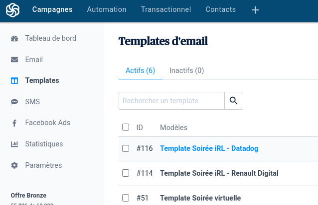

# ParisJUG event-publisher project

Downloads: https://github.com/parisjug/event-publisher/releases

a CLI used by the ParisJUG crew to publish events

Open the project in Eclipse Che developer environment (hosted by Red Hat, requires an account to be created first https://developers.redhat.com/developer-sandbox/ide): [](https://workspaces..openshift.com#https://github.com/parisjug/event-publisher)

Currently supported:
```bash
parisjug-event-publisher gcal https://www.parisjug.org/xwiki/wiki/oldversion/view/Meeting/20201208 # will generate a google calendar url, fetching data from the wiki page in parameter
parisjug-event-publisher campaign https://www.parisjug.org/xwiki/wiki/oldversion/view/Meeting/20201208 # create a sendinblue campaign, fetching data from the wiki page in parameter
```

For sendinblue campaign, it is possible to use other templates.
For instance to use the datadog template: 
1. get the template id from:
   
   
2. datadog has the template number 116. Use this command:
   ```
   ./parisjug-event-publisher-linux campaign --template=116 https://www.parisjug.org/xwiki/wiki/oldversion/view/Meeting/20211214
   ```
If no template is provided, the 51 one will be used which refers to the virtual event template.

To have it working, the CLI needs the sendinblue api-key. You can generate new api-key from https://account.sendinblue.com/advanced/api.
Then, use it either with env variable:
```
export SENDINBLUE_APIKEY=<your-apikey>
```
or set to the `src/main/resources/application.properties`:
```
sendinblue.apikey=<your-apikey>
```
or in Eclipse Che/CodeReady workspaces

```sendinblue.yaml
apiVersion: v1
kind: Secret
metadata:
  name: sendinblue-secret
  labels:
    app.kubernetes.io/part-of: che.eclipse.org
    app.kubernetes.io/component: workspace-secret
  annotations:
    che.eclipse.org/automount-workspace-secret: 'true'
    che.eclipse.org/env-name: SENDINBLUE_APIKEY
    che.eclipse.org/mount-as: env
data:
  mykey: <you-api-key-encoded-in-base64>
```

```
kubectl apply -f sendinblue.yaml -n <namespace-were-your-workspace-is-running>
```

## using from source 

```bash
git clone https://github.com/parisjug/event-publisher.git
# export SENDINBLUE_APIKEY=xkeysib-1234567890abcdef1234567890abcdef1234567890abcdef1234567890abcdef-1234567890ABCDEF
# or source .envrc
# or use  direnv with .envrc containing export SENDINBLUE_APIKEY=xkeysib-1234567890abcdef1234567890abcdef1234567890abcdef1234567890abcdef-1234567890ABCDEF
mvn clean test quarkus:build &&\
  cd target/quarkus-app/ &&\
  java -jar quarkus-run.jar campaign \
   --template=222 \
    https://www.parisjug.org/events/2024/03-12-ci-cd/
```